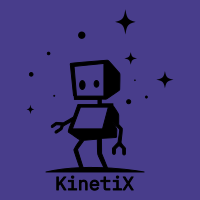
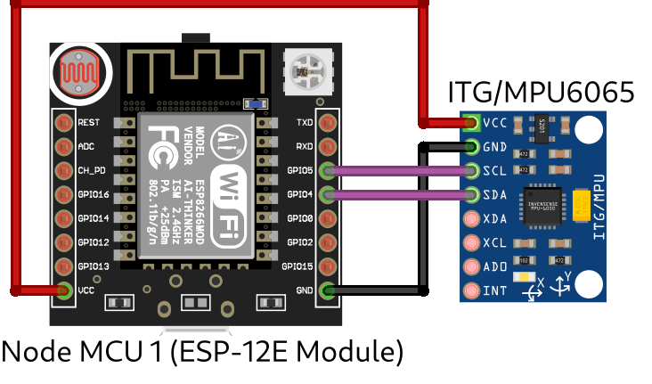

# KinetiX

KinetiX è un progetto che prevede la realizzazione di un braccio meccanico controllato a distanza tramite un accelerometro. L'obiettivo è quello di creare un sistema che permetta di controllare il braccio attraverso il rilevamento dei movimenti del corpo al fine di rendere l'utilizzo intuitivo e naturale.

Il progetto è composto da due parti:
- Il guanto che ospita l'accelerometro MCU-6050 utilizzato per il riconoscimento dei movimenti e un Node MCU
- Il braccio meccanico composto da 3 motori Servo controllati da un Arduino Uno e un Node MCU

Questi due moduli comunicano tra di loro in modo wireless attraverso il protocollo di Mesh Networking.

## Table of contents
- [Componenti necessari](#comonenti_neccessari)
- [KinetiX Client](#kinetix_client)
- [KinetiX Server](#kinetix_server)
- [Costruzione del braccio meccanico](#costruzione_del_braccio_meccanico)

<a name="componenti_necessari"/>
## Componenti necessari
</a>
1. [Node MCU 1](https://www.amazon.it/Diymore-ESP8266-Sviluppo-Compatibile-Micropython/dp/B09Z6T2XS4) (ESP-12E Module) [x2]
2. [ITC/MPU6050](https://www.amazon.it/MPU-6050-MPU6050-accelerometro-giroscopio-Converter/dp/B07XRK5FHP) Accelerometer [x1]
3. [Arduino Uno](https://www.amazon.it/Elegoo-ATmega328P-ATMEGA16U2-Compatibile-Microcontrollore/dp/B01MRJR8UF) [x1]
4. [Servo-motore](https://www.amazon.it/HUAZIZ-Servomotore-Camminare-Elicottero-Aeroplano/dp/B09Z21J1JH) [x3]
5. Materiali per costruire il braccio
6. Jumper wires

##<a name="kinetix_client">
KinetiX Client
</a>
Il Client in questo schema corrisponde all'accelerometro e al relativo Node MCU.
Per compilare e caricare il codice del Client (`ESP_client/ESP_client.ino`) è necessario installare alcune librerie e Boards nell'IDE di Arduino:
- [Installare pacchetto per compatibilità con ESP8266](https://randomnerdtutorials.com/installing-esp8266-nodemcu-arduino-ide-2-0/)
- Installare la libreria `Painless Mesh` dal gestore delle librerie interno all'IDE
- Installare la libreria `Arduino_JSON` dal gestore delle librerie interno all'IDE
- Installare la libreria `MPU6050` dal gestore delle librerie interno all'IDE

Sul Node MCU i nomi dei pin potrebbero cambiare leggermente rispetto a quelli riportati nell'immagine, in generale:

| Node MCU Immagine | Node MCU Utilizzato |
|:-----------------:|:-------------------:|
|        VCC        |        3.3V         |
|        GND        |         GND         |
|       GPIO5       |         D1          |
|       GPO4        |         D2          |

<a name="kinetix_server"/>
## KinetiX Server
</a>
Il server corrisponde al Node MCU che riceve i dati dall'accelerometro.
Per compilare e caricare il codice del Client (`ESP_server/ESP_server.ino`) è necessario installare alcune librerie e Boards nell'IDE di Arduino:
- [Installare pacchetto per compatibilità con ESP8266](https://randomnerdtutorials.com/installing-esp8266-nodemcu-arduino-ide-2-0/)
- Installare la libreria `Painless Mesh` dal gestore delle librerie interno all'IDE
- Installare la libreria `Arduino_JSON` dal gestore delle librerie interno all'IDE

<a name="costruzione_del_braccio_meccanico"/>
## Costruzione del braccio meccanico
</a>
